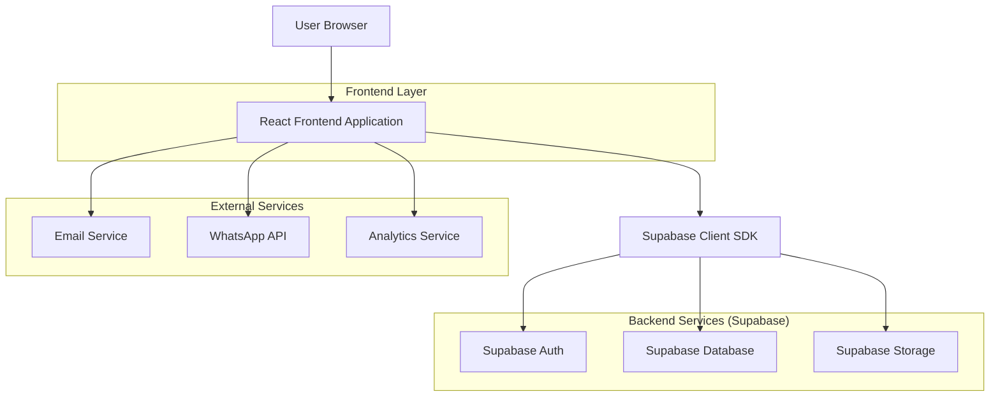
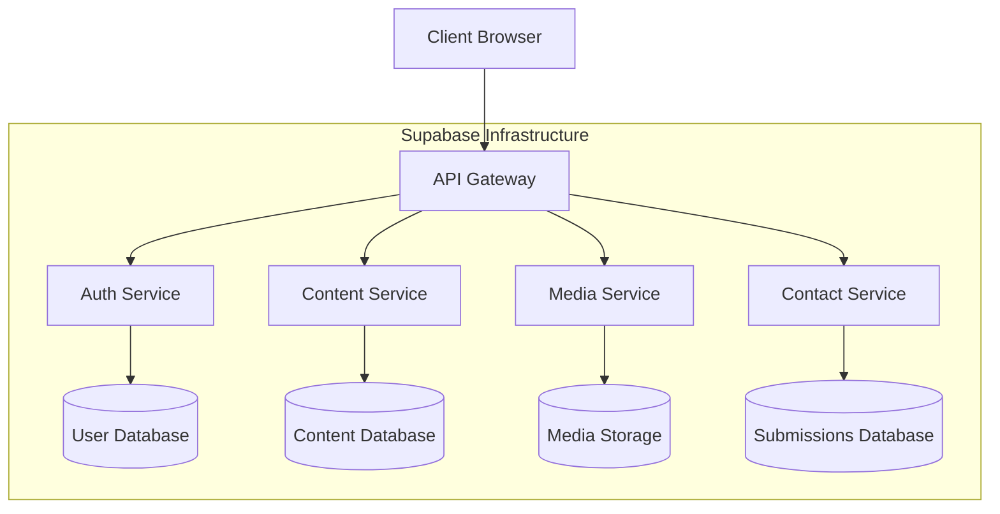

## 1. Architecture design



## 2. Technology Description

- Frontend: React@18 + tailwindcss@3 + vite
- Initialization Tool: vite-init
- Backend: Supabase (PostgreSQL, Auth, Storage)
- State Management: React Context + useReducer
- Routing: React Router v6
- Forms: React Hook Form + Yup validation
- Rich Text Editor: TipTap or Slate.js
- Image Optimization: Sharp.js (server-side)
- Email Service: Resend ou SendGrid
- Analytics: Google Analytics 4 + Google Tag Manager
- Deployment: Vercel (frontend) + Supabase (backend)

## 3. Route definitions

| Route | Purpose |
|-------|---------|
| / | Home page principal com hero e serviços |
| /empresa | Página institucional com história e valores |
| /areas-de-atuacao | Listagem de áreas de atuação |
| /areas-de-atuacao/:slug | Detalhes de área específica |
| /servicos | Listagem de todos os serviços |
| /servicos/:slug | Página detalhada de serviço |
| /portfolio | Galeria de projetos com filtros |
| /portfolio/:slug | Detalhes do projeto com galeria |
| /parceiros | Lista de parceiros e clientes |
| /contato | Formulário e informações de contato |
| /admin/login | Login do painel administrativo |
| /admin/dashboard | Dashboard principal do admin |
| /admin/paginas | Gerenciamento de páginas |
| /admin/paginas/nova | Criar nova página |
| /admin/paginas/:id/editar | Editor de página existente |
| /admin/midia | Biblioteca de mídias |
| /admin/configuracoes | Configurações gerais e SEO |

## 4. API definitions

### 4.1 Authentication API

```
POST /auth/v1/token?grant_type=password
```

Request:
| Param Name | Param Type | isRequired | Description |
|------------|-------------|-------------|-------------|
| email | string | true | Email do usuário |
| password | string | true | Senha do usuário |

Response:
| Param Name | Param Type | Description |
|------------|-------------|-------------|
| access_token | string | JWT token para autenticação |
| refresh_token | string | Token para renovar sessão |
| user | object | Dados do usuário autenticado |

### 4.2 Pages API

```
GET /rest/v1/pages
```

Query Parameters:
| Param Name | Param Type | Description |
|------------|-------------|-------------|
| slug | string | Filtrar por slug da página |
| published | boolean | Filtrar apenas páginas publicadas |
| limit | number | Limite de resultados |

Response:
```json
{
  "id": "uuid",
  "title": "string",
  "slug": "string",
  "content": "json",
  "meta_title": "string",
  "meta_description": "string",
  "featured_image": "string",
  "published": "boolean",
  "created_at": "timestamp",
  "updated_at": "timestamp"
}
```

### 4.3 Contact Form API

```
POST /rest/v1/contact_submissions
```

Request:
| Param Name | Param Type | isRequired | Description |
|------------|-------------|-------------|-------------|
| name | string | true | Nome do remetente |
| email | string | true | Email para resposta |
| phone | string | false | Telefone de contato |
| subject | string | true | Assunto da mensagem |
| message | string | true | Conteúdo da mensagem |

## 5. Server architecture diagram



## 6. Data model

### 6.1 Data model definition

```mermaid
erDiagram
    USERS ||--o{ PAGES : creates
    USERS ||--o{ MEDIA : uploads
    PAGES ||--o{ PAGE_REVISIONS : has
    MEDIA ||--o{ PAGES : "used in"
    CONTACT_SUBMISSIONS ||--o{ USERS : 