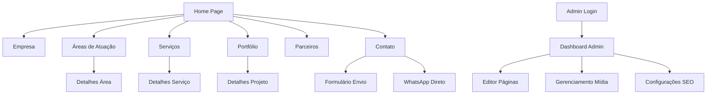

## 1. Product Overview

Site institucional corporativo completo com CMS headless para gestão de conteúdo, inspirado em sites como irw.com.br. O produto permite que empresas criem e gerenciem seu presença online de forma profissional com total autonomia na edição de conteúdo.

O site resolve a necessidade de empresas terem um portal institucional moderno, totalmente editável sem conhecimentos técnicos, com SEO otimizado e integrações essenciais para negócios B2B.

## 2. Core Features

### 2.1 User Roles
| Role | Registration Method | Core Permissions |
|------|---------------------|------------------|
| Administrador | Convite via email pelo super admin | Gerenciar usuários, editar todas as páginas, configurar SEO, acessar analytics |
| Editor | Convite via email pelo administrador | Editar páginas e conteúdo, gerenciar mídia, visualizar analytics |
| Visitante | Não requer registro | Navegar pelo site, enviar formulários de contato |

### 2.2 Feature Module
O site institucional consiste nas seguintes páginas principais:

1. **Home**: hero section, serviços em destaque, formulário de contato, depoimentos
2. **Empresa**: história, valores, missão e visão, equipe
3. **Áreas de Atuação**: listagem de áreas, detalhamento individual de cada área
4. **Serviços**: listagem de serviços, páginas detalhadas por serviço
5. **Portfólio**: galeria de projetos com filtros por categoria
6. **Parceiros**: lista de parceiros e clientes
7. **Contato**: formulário de contato, informações de localização, integração WhatsApp
8. **Admin**: dashboard administrativo, editor de páginas, gerenciamento de mídia

### 2.3 Page Details
| Page Name | Module Name | Feature description |
|-----------|-------------|---------------------|
| Home | Hero Section | Apresentar banner principal com slides automáticos, texto sobreposto e call-to-action destacado |
| Home | Serviços Destaque | Exibir cards dos principais serviços com ícones e descrições resumidas |
| Home | Formulário Contato | Capturar leads com campos nome, email, telefone, mensagem e envio para CRM |
| Empresa | História | Apresentar timeline da empresa com imagens e texto editável |
| Empresa | Valores | Listar valores corporativos com ícones e descrições |
| Áreas de Atuação | Listagem | Exibir grid de áreas com imagem, título e descrição resumida |
| Áreas de Atuação | Detalhes | Página individual com descrição completa, cases e serviços relacionados |
| Serviços | Listagem | Apresentar todos os serviços em cards organizados por categoria |
| Serviços | Detalhes | Página dedicada com descrição detalhada, processo, diferenciais e formulário de orçamento |
| Portfólio | Galeria | Exibir projetos em grid com imagens, filtros por categoria e paginação |
| Portfólio | Detalhes do Projeto | Página individual com galeria de imagens, descrição, tecnologias utilizadas e resultados |
| Contato | Formulário | Campos para nome, email, telefone, assunto, mensagem com validação e envio por email |
| Contato | Mapa | Integração com Google Maps mostrando localização da empresa |
| Contato | WhatsApp | Botão flutuante e link direto para WhatsApp Business |
| Admin | Dashboard | Visualizar estatísticas de acesso, páginas recentes e atividades |
| Admin | Editor de Páginas | Editor WYSIWYG para texto, imagens, vídeos com preview ao vivo |
| Admin | Gerenciamento de Mídia | Upload, organização por pastas, tags, compressão automática de imagens |
| Admin | SEO | Configurar meta tags, URLs amigáveis, sitemap e integração com Search Console |

## 3. Core Process

### Fluxo do Visitante
O usuário acessa a home page, navega pelos menus principais, explora serviços e portfolio, e quando interessado, preenche o formulário de contato ou clica no WhatsApp. O sistema captura o lead e envia para o email da empresa.

### Fluxo do Administrador
O admin acessa o painel administrativo, cria/edita páginas usando o editor visual, gerencia mídias na biblioteca, configura SEO por página, e publica alterações que ficam imediatamente disponíveis no site.

### Fluxo do Editor
O editor acessa páginas específicas para edição, utiliza o editor WYSIWYG para modificar conteúdo, faz upload de novas imagens, e solicita aprovação do administrador para publicação.

## 4. User Interface Design

### 4.1 Design Style
- **Cores Primárias**: Azul profissional (#1e40af) e cinza escuro (#1f2937)
- **Cores Secundárias**: Branco (#ffffff), cinza claro (#f3f4f6), verde para CTAs (#10b981)
- **Botões**: Estilo arredondado com sombra sutil, hover effects suaves
- **Tipografia**: Fonte sans-serif moderna (Inter ou similar), títulos 32-48px, corpo 16-18px
- **Layout**: Baseado em cards com grid responsivo, navegação sticky no topo
- **Ícones**: Estilo line-icons minimalistas, consistentes em todo o site
- **Animações**: Transições suaves de 300ms, fade-in ao scroll

### 4.2 Page Design Overview
| Page Name | Module Name | UI Elements |
|-----------|-------------|-------------|
| Home | Hero Section | Banner full-width com altura 80vh, texto centralizado com animação fade-in, botão CTA destacado em verde |
| Home | Serviços | Grid 3x2 em desktop, cards com ícone 64px, título 24px, descrição 16px, hover scale 1.05 |
| Empresa | Timeline | Linha vertical com círculos para anos, conteúdo alternado lado a lado, imagens 400x300px |
| Serviços | Listagem | Cards horizontais com imagem 300x200px à esquerda, conteúdo à direita, sombra card 0 4px 6px rgba(0,0,0,0.1) |
| Portfólio | Galeria | Masonry grid com gap 24px, imagens com overlay escuro 0.7 ao hover, ícone zoom centralizado |
| Contato | Formulário | Campos com borda arredondada 8px, foco em azul primário, botão submit largura total em verde |
| Admin | Editor | Interface split-screen com editor à esquerda, preview à direita, toolbar fixa no topo |

### 4.3 Responsiveness
Desktop-first com breakpoints em 1024px (tablet) e 768px (mobile). Menu hamburger em mobile, cards empilham verticalmente, fontes reduzem 10%, imagens adaptam com object-fit cover. Touch otimizado com áreas de toque mínimas 44x44px.

### 4.4 3D Scene Guidance
Não aplicável - Site institucional 2D com foco em conteúdo e usabilidade.