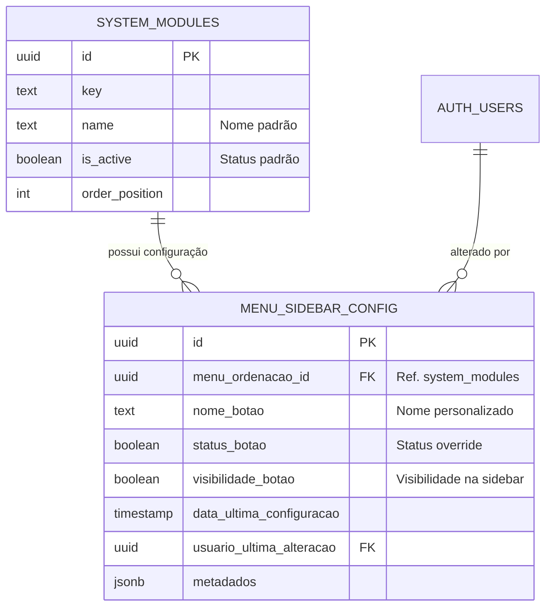

# Módulo Menu SideBar - Especificação Técnica

Este documento detalha a implementação do novo módulo de configuração "Menu SideBar" para o KoreBiz-Pro.

## 1. Visão Geral

O módulo permite a personalização avançada dos itens do menu lateral (sidebar), incluindo renomeação de botões, controle de visibilidade independente do status do módulo e armazenamento de metadados adicionais.

## 2. Estrutura do Banco de Dados

### Diagrama Entidade-Relacionamento (ER)



### Tabela `menu_sidebar_config`

| Campo | Tipo | Descrição |
|-------|------|-----------|
| `id` | UUID | Chave primária. |
| `menu_ordenacao_id` | UUID | Chave estrangeira para `system_modules`. |
| `nome_botao` | TEXT | Nome personalizado para exibição no botão. |
| `status_botao` | BOOLEAN | Sobrescreve o status `is_active` do módulo original. |
| `visibilidade_botao` | BOOLEAN | Controla se o botão aparece na sidebar (mesmo se ativo). |
| `metadados` | JSONB | Campo flexível para ícones, cores, badges, etc. |

## 3. API RESTful (Edge Function)

A API é servida através de uma Supabase Edge Function: `/functions/v1/menu-sidebar`

### Endpoints

#### `GET /api/menu-sidebar`
Lista todas as configurações de menu.
- **Cache**: `public, max-age=60` (para não-admins).
- **Feature Flag**: Respeita `site_settings.features.menu_sidebar_v2`.

#### `GET /api/menu-sidebar/{id}`
Retorna uma configuração específica pelo ID da configuração.

#### `POST /api/menu-sidebar`
Cria uma nova configuração para um módulo existente.
- **Body**: `{ "menu_ordenacao_id": "uuid", "nome_botao": "Texto", ... }`
- **Permissão**: Apenas Admins.

#### `PUT /api/menu-sidebar/{id}`
Atualiza uma configuração existente.
- **Body**: `{ "nome_botao": "Novo Texto", ... }`
- **Permissão**: Apenas Admins.

#### `PATCH /api/menu-sidebar/{id}/status`
Endpoint específico para alterar status e visibilidade.
- **Body**: `{ "status_botao": true, "visibilidade_botao": false }`

#### `DELETE /api/menu-sidebar/{id}`
Remove a personalização, revertendo o módulo para o estado original.

## 4. Integração e Retrocompatibilidade

A função RPC `get_system_modules_config` foi atualizada para realizar um `LEFT JOIN` com a nova tabela `menu_sidebar_config`.
Isso garante que o frontend existente continue funcionando sem alterações de código, mas já refletindo os novos nomes e status configurados.

### Feature Flags
O rollout é controlado via coluna `features` na tabela `site_settings`:
```json
{
  "menu_sidebar_v2": true
}
```

## 5. Guia de Migração

Para habilitar o novo módulo em ambientes existentes:

1. Executar a migration `20260306120000_create_menu_sidebar.sql`.
2. Executar a migration `20260306123000_add_features_column.sql`.
3. Executar a migration `20260306124500_update_rpc_get_modules.sql`.
4. Deploy da Edge Function `menu-sidebar`.
5. Ativar a feature flag no banco de dados:
   ```sql
   UPDATE site_settings SET features = jsonb_set(features, '{menu_sidebar_v2}', 'true');
   ```

## 6. Manual de Configuração (Admins)

1. Acesse o painel administrativo.
2. Navegue até Configurações > Menu Sidebar.
3. Utilize a interface (a ser desenvolvida no frontend) para editar os nomes e visibilidade dos botões.
4. As alterações são refletidas em tempo real (após invalidação do cache de 60s).
