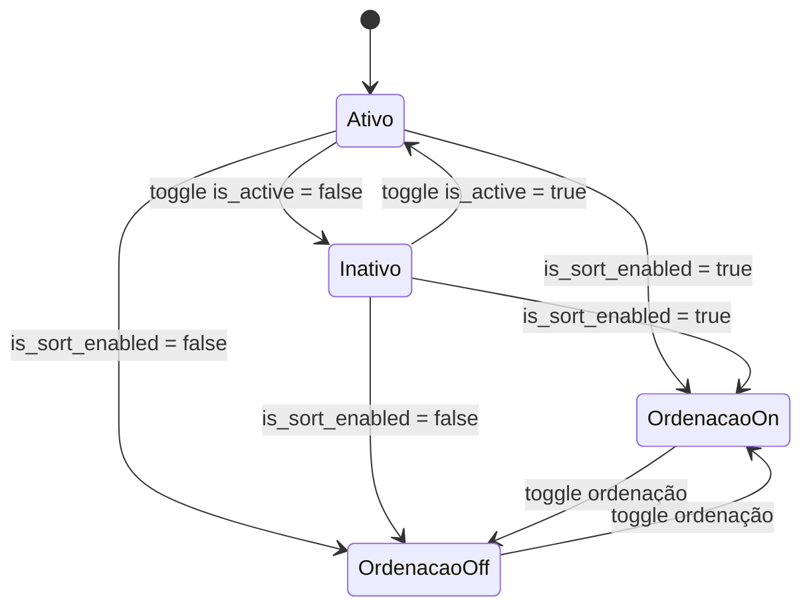

# API de Configuração da SideBar

## Objetivo

Centralizar no backend o controle dos botões configuráveis do Menu FrontEnd:

- Áreas de Atuação (`areas_atuacao`)
- Parceiros (`parceiros`)
- Serviços (`servicos`)
- Portfólio (`portfolio`)
- Páginas/Empresa (`paginas`)

Itens fixos não entram no fluxo de configuração e ordenação:

- Home
- Demais itens administrativos não configuráveis da SideBar

## Endpoints RPC (Supabase)

### 1) `get_system_modules_config`

Retorna os botões configuráveis ordenados por `order_position`.

**Request**

```json
{}
```

**Response**

```json
[
  {
    "id": "uuid",
    "key": "areas_atuacao",
    "name": "Áreas de Atuação",
    "is_active": true,
    "is_sort_enabled": true,
    "order_position": 1,
    "updated_at": "2026-03-03T12:00:00Z",
    "updated_by": "uuid"
  }
]
```

### 2) `update_system_module_config`

Atualiza estado de exibição e modo de ordenação de um botão.

**Request**

```json
{
  "p_key": "servicos",
  "p_is_active": true,
  "p_is_sort_enabled": true
}
```

**Response**

```json
{
  "id": "uuid",
  "key": "servicos",
  "name": "Serviços",
  "is_active": true,
  "is_sort_enabled": true,
  "order_position": 2,
  "updated_at": "2026-03-03T12:10:00Z",
  "updated_by": "uuid"
}
```

### 3) `reorder_system_modules`

Reordena o grupo configurável por drag-and-drop, com transação atômica.

**Request**

```json
{
  "p_keys": ["parceiros", "servicos", "areas_atuacao", "portfolio", "paginas"]
}
```

**Response**

```json
[
  {
    "key": "parceiros",
    "order_position": 1,
    "is_active": true
  },
  {
    "key": "paginas",
    "order_position": 5,
    "is_active": false
  }
]
```

## Regras de Negócio

- Home nunca é alterado por essas rotinas.
- Não é permitido desativar todos os botões configuráveis.
- Botões inativos são movidos automaticamente para o final do grupo configurável.
- Reordenação usa lock e transação única no banco para consistência.
- Falha durante reordenação gera rollback automático pelo PostgreSQL.

## Diagrama de Estados



## Query de Migração

Arquivo: `supabase/migrations/20260303103000_sidebar_module_ordering.sql`

Principais mudanças:

- `ALTER TABLE public.system_modules ADD COLUMN order_position INTEGER`
- `ALTER TABLE public.system_modules ADD COLUMN is_sort_enabled BOOLEAN`
- criação de `public.system_module_audit_logs`
- criação de funções:
  - `public.get_system_modules_config()`
  - `public.update_system_module_config(...)`
  - `public.reorder_system_modules(...)`
  - `public.rebalance_system_modules_order_positions()`

## Log de Auditoria

Tabela: `public.system_module_audit_logs`

Campos usados para rastreabilidade:

- `action`: `update_module_config` ou `reorder_modules`
- `module_key`: chave do botão afetado (ou `null` em reordenação em lote)
- `previous_state`: snapshot anterior
- `next_state`: snapshot posterior
- `changed_by`: usuário autenticado responsável
- `created_at`: timestamp da alteração
